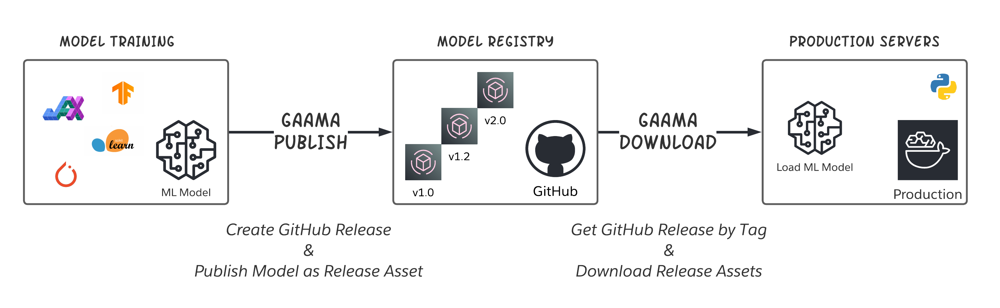

# gaama
GaAMA: GitHub-as-Artifactory for Model Artifacts



## Usage
- Read this [blog post](http://omkar.xyz/gaama/) for the idea behind GaAMA!
- Install `gaama` using:
```
pip install gaama
```
- See [example notebook](examples/example.ipynb) with PyTorch model

## License
This project is licensed under [Apache License 2.0](LICENSE).