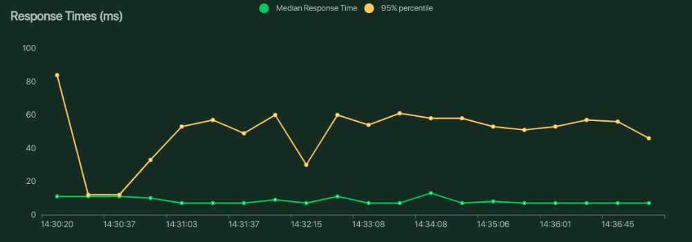
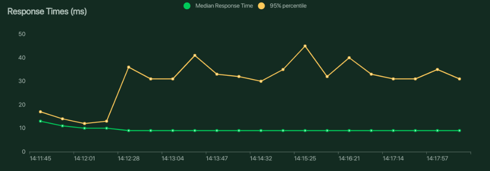
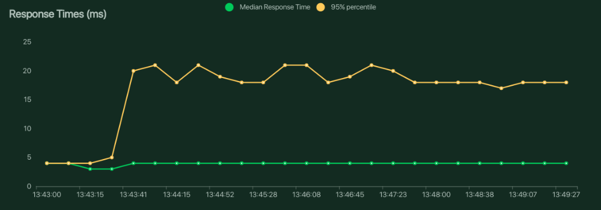

# PTIBench: PyTorch Inference Server Benchmark

## About
This repository is a playground to benchmark several existing (and popular) model serving frameworks for PyTorch.  
It also acts as a reference kit to generate, run and benchmark your own model in available frameworks. 

## Models

| Model Name | Precision | GPU | Type |
| ---------- | --------- | --- | ---- |
| EfficientNet-B0 | FP32 | True | NVIDIA Triton Inference Server |
| EfficientNet-B0 | FP32 | True | PyTorch Serve |
| EfficientNet-B0 | FP32 | True | Vanilla Python gRPC |

## Results
Note: These results are captured on a machine with Intel i7 CPU, 16GB RAM and NVIDIA RTX 3050Ti GPU using [Locust](https://locust.io/) with 1000 users for 5 minutes.

| Type | Response Time | Total Requests (Request Per Second) |
| ---- | ------------- | ----------------------------------- |
| Vanilla Python gRPC |  | 17340 (43.5) |
| PyTorch Serve |  | 17493 (44.9) |
| NVIDIA Triton Inference Server |  | 28133 (71.9) |

### Generate and Usage
This section will help you compile and generate modules which can be served.

- Compile and generate assets to be used for serving using the command:
```
cd models/efficientnet-b0
docker run --rm -it --gpus all -v ${PWD}:/scratch_space nvcr.io/nvidia/pytorch:<xx.yy>-py3 # e.g. <xx.yy> = 22.05
cd /scratch_space
python3 conversion.py
exit
```
- Copy the outputs in their respective directory for usage:
```
mv model_fp32.pt ../services/triton/model_repository/efficientnet_b0/1/model.pt
cp ts_model_fp32.pt ../services/torchserve/ts_model.pt
cp ts_model_fp32.pt ../services/python-grpc/ts_model.pt
OR
mv model_fp16.pt ../services/triton/model_repository/efficientnet_b0/1/model.pt
cp ts_model_fp16.pt ../services/torchserve/ts_model.pt
cp ts_model_fp16.pt ../services/python-grpc/ts_model.pt
```

#### NVIDIA Triton Inference Server
- Run NVIDIA Triton Inference Server using:
```
cd services/triton
docker run --gpus all --rm -p 8000:8000 -p 8001:8001 -p 8002:8002 -v <absolute_path_to_ptibench_directory>/model_repository:/models \
    nvcr.io/nvidia/tritonserver:<xx.yy>-py3 tritonserver --model-repository=/models # e.g. <xx.yy> = 22.05
```

#### TorchServe
- Generate MAR for running TorchServe:
```
cd services/torchserve
torch-model-archiver --model-name efficientnet_b0 --version 1.0 --serialized-file ts_model.pt --handler handler.py
```
- Run TorchServe using:
```
docker run --rm -it --gpus all -p 8080:8080 -p 8081:8081 -v ${PWD}/model-store:/home/model-server/model-store \
    pytorch/torchserve:latest-gpu torchserve --model-store /home/model-server/model-store/ --models efficientnet_b0=efficientnet_b0.mar
```

#### Python gRPC
- Generate Docker Image using:
```
cd services/python-grpc
docker build . -t torch-python-grpc
```
- Run it in a container using:
```
docker run --rm --gpus all -p 8080:8080 torch-python-grpc
```

### Running Benchmarks
This section will help you run benchmark and save results

#### NVIDIA Triton Inference Server
- Run locust load tests using
```
cd services/triton
locust -f locust_client.py
```

#### TorchServe
- Run locust load tests using
```
cd services/torchserve
locust -f locust_client.py
```

#### Python gRPC
- Run locust load tests using
```
cd services/python-grpc
locust -f locust_client.py
```

## TODOs/Improvements
- Refactor the clients of locust testing to be consistent across all services
- Run benchmarks weekly/on latest versions using common GPU spec
- Use FP16 for inference as well
- Generate some fancy graphs using the saved results 
- Improve the way load testing is done using locust

## License
This project is licensed under [MIT License](LICENSE).